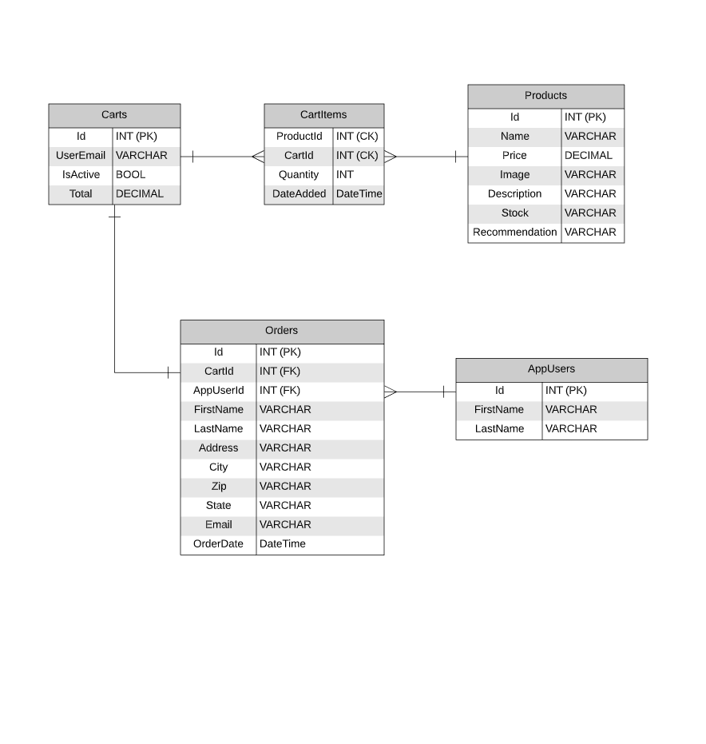

# Ecommerce App

*Author: Andrew Smith & Robert Carter*

---

### Description

An Ecommerce website that specializes in selling computer parts. Application users have the 
ability create accounts, login, add items to cart and checkout with a cart. We currently have 10 items in the store to sell, with
two of those items being displayed on the home page (to entice potential buyers to check out the rest of our products).
We are capturing several claims when a user registers and logs in. The user (or admin) email address as well as their first name, last name, 
and password are utilized to authenticate user identity. The user is also able to add items to a cart, update quantities and delete items within the cart,
and purchase items via a checkout page. The user also receives emails upon a successful checkout and when they register an account.

To have full access to the site (including the Admin dashboard), one must be logged in as the administrator. But average users can
have full accessibility to the site whether they have registered an account or not. The difference between these two users is that the cart
information for registered accounts is persistent (exists after checkout) while anonymous user data is not accessible after checkout.
User accounts are authenticated by their email while anonymous users are authenticated by a cookie the site provides after they enter the site.

---

### Getting Started

Go to this link: https://ecom17.azurewebsites.net/
Once there, you can either go to Products to view the products or to Register or Login to create or utilize an existing account, respectively.
If you find a product you want, press "Add to Cart"
Once you add all items you want in a cart, press the cart shaped button to "Checkout"
Fill in relevant billing data (all credit card information is defaulted to a test credit card hard-coded into the database)
Once this is done, you will go to an order summary page, and a receipt will be sent to the email address entered in checkout.

---

### Visuals

Schema: We decided to create several models which work in concert with each other. We have Products (contains all properties of each individual product),
CartItems (Products selected by the user to be put into a cart), Cart(All CartItems a user has selected), Orders(All information the site needs from the user 
to process an order and purchase their cartItems), and AppUsers(deals with persistent identities of logged in users and the Admin). 
We also have RoleInitializer which helps create the special roles of the Admin compared to other users.

---

### Change Log

- 2.6 Users can update their personal info from the profile page - 24 Aug 2020
- 2.5 Users now have a profile page - 23 Aug 2020
- 2.4 Admin dashboard is now locked down to users with admin roles -22 Aug 2020
- 2.3 Users can now check out and pay for items -20 Aug 2020
- 2.2 Got the user cart working -18 Aug 2020
- 2.1 Deployed website -17 Aug 2020
- 2.0 Populate Home and Products with Blob images - 16 Aug 2020
- 1.9 Created Blob and Linked to App - 15 Aug 2020
- 1.8 Added Admin Role - 14 Aug 2020
- 1.7 Login Razor Page - 12 Aug 2020
- 1.6 Register Razor page - 11 Aug 2020
- 1.5 Unit tests for InventoryManagement - 11 Aug 2020
- 1.4 InventoryManagement Service - 11 Aug 2020
- 1.3 Products page - 10 Aug 2020
- 1.2 Home page - 10 Aug 2020
- 1.1 Add MVC structure - 10 Aug 2020

---

### Creator Contact Info

Robert Carter:
- [LinkedIn](https://www.linkedin.com/in/robert-carter-035baa165/)
- [GitHub](https://github.com/racarter1215)

Andrew Smith:
- [LinkedIn](https://www.linkedin.com/in/andrew149/)
- [GitHub](https://github.com/AndrewCS149)
